# Informe Tecnico - Analisis Trivy y Despliegue CI/CD en AWS K3s

## 1. Objetivo

Documentar la ejecucion de la practica realizada sobre el proyecto `actividad-e-practica-3-devsecops-trivy`, considerando dos componentes principales: el analisis de vulnerabilidades con Trivy y el despliegue automatizado en AWS mediante GitHub Actions y K3s.

El objetivo tecnico fue construir las imagenes Docker del backend y frontend, ejecutar escaneos de seguridad con Trivy, publicar las imagenes en Docker Hub y desplegar la aplicacion en un cluster K3s instalado sobre una instancia EC2 de AWS.

## 2. Alcance de la practica

La practica se desarrollo en dos bloques principales, ambos documentados con evidencias:

- Analisis DevSecOps con Jenkins y Trivy: construccion de imagenes, validacion Docker, escaneo de vulnerabilidades, generacion de reportes y publicacion en Docker Hub.
- Despliegue CI/CD en AWS K3s: ejecucion de GitHub Actions, uso de runner self-hosted en EC2, aplicacion de manifiestos Kubernetes y validacion de la aplicacion publicada.

Se decidio no ejecutar redeploy sobre Railway para no afectar servicios de practicas anteriores. Railway no forma parte del flujo de la guia AWS K3s.

## 3. Repositorio y configuracion base

Repositorio utilizado:

```text
https://github.com/cazzSoft/actividad-e-practica-3-devsecops-trivy
```

Estructura verificada:

- `.github/workflows/kubernetes.yml`
- `backend/Dockerfile`
- `frontend/Dockerfile`
- `k8s/`
- `Jenkinsfile`

**Evidencia:** `evidencias/github/01_repo_k8s_workflows.png`

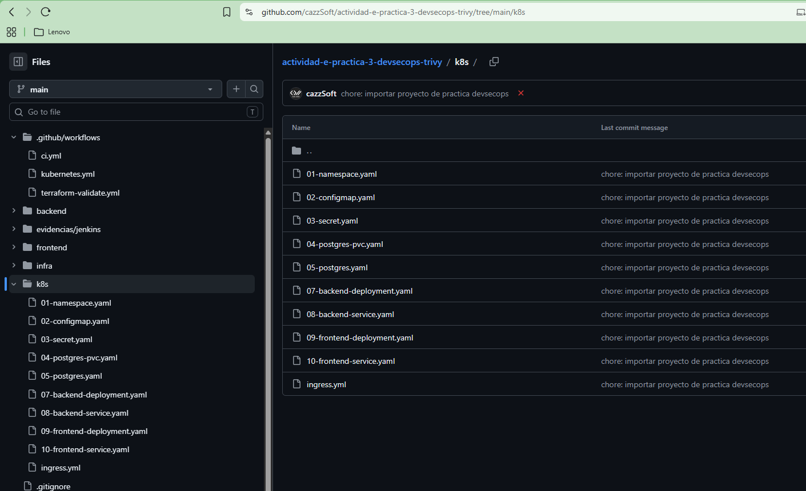

## 4. Jenkins, Docker y Trivy

### 4.1 Ejecucion inicial del pipeline Jenkins

**Evidencia:** `evidencias/jenkins/01_pipeline_ejecucion_inicial.png`

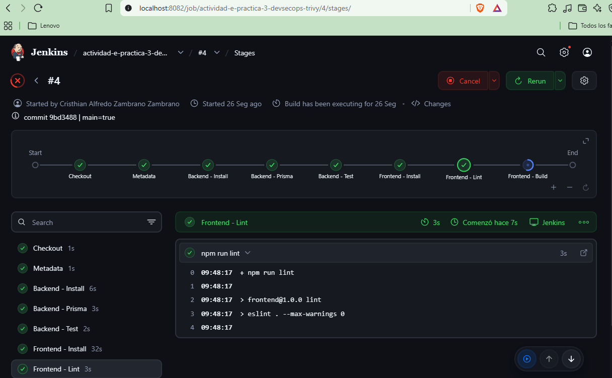

Se ejecuto el job `actividad-e-practica-3-devsecops-trivy` en Jenkins. El pipeline obtuvo el codigo desde la rama `main` del repositorio GitHub y ejecuto correctamente las etapas iniciales:

- `Checkout`
- `Metadata`
- `Backend - Install`
- `Backend - Prisma`
- `Backend - Test`
- `Frontend - Install`
- `Frontend - Lint`

### 4.2 Incidencia Docker Compose

**Evidencia:** `evidencias/jenkins/02_error_docker_compose_validate.png`

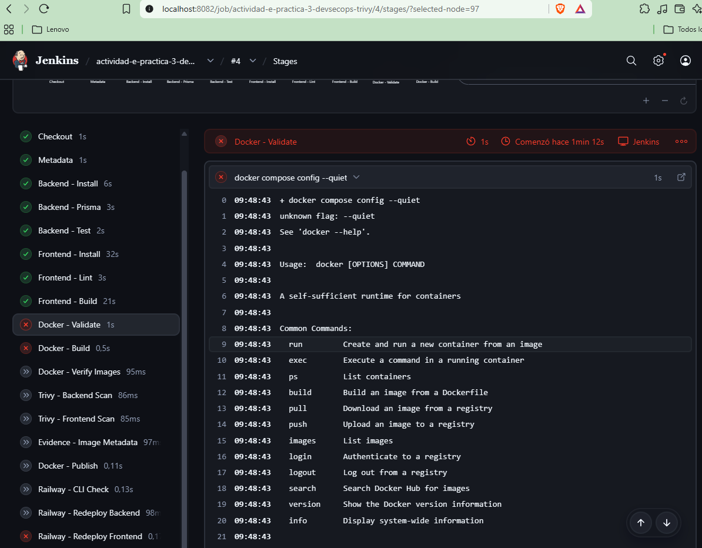

Durante el build `#4`, la etapa `Docker - Validate` fallo al ejecutar:

```text
docker compose config --quiet
```

El mensaje fue:

```text
unknown flag: --quiet
See 'docker --help'.
```

Se valido que el contenedor Jenkins tenia Docker instalado, pero no tenia disponible `docker compose` ni `docker-compose`. Como accion correctiva, se ajusto el `Jenkinsfile` para construir las imagenes mediante `docker build` directo.

### 4.3 Analisis Trivy ejecutado correctamente

**Evidencia:** `evidencias/jenkins/03_pipeline_trivy_ok_publish_error.png`

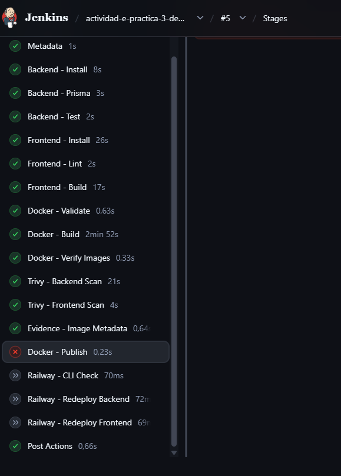

En el build `#5`, las etapas principales de Docker y Trivy finalizaron correctamente:

- `Docker - Build`
- `Docker - Verify Images`
- `Trivy - Backend Scan`
- `Trivy - Frontend Scan`
- `Evidence - Image Metadata`

Se generaron reportes JSON para backend y frontend:

- `backend-trivy.json`
- `frontend-trivy.json`
- `backend-image-inspect.json`
- `frontend-image-inspect.json`
- `docker-images.txt`

Posteriormente fallo `Docker - Publish` porque Jenkins buscaba la credencial `jenkins-u3`, inexistente en el servidor:

```text
ERROR: Could not find credentials entry with ID 'jenkins-u3'
```

### 4.4 Correccion de credencial Docker Hub y ejecucion final Jenkins

**Evidencia:** `evidencias/jenkins/04_pipeline_publish_ok_railway_skipped.png`

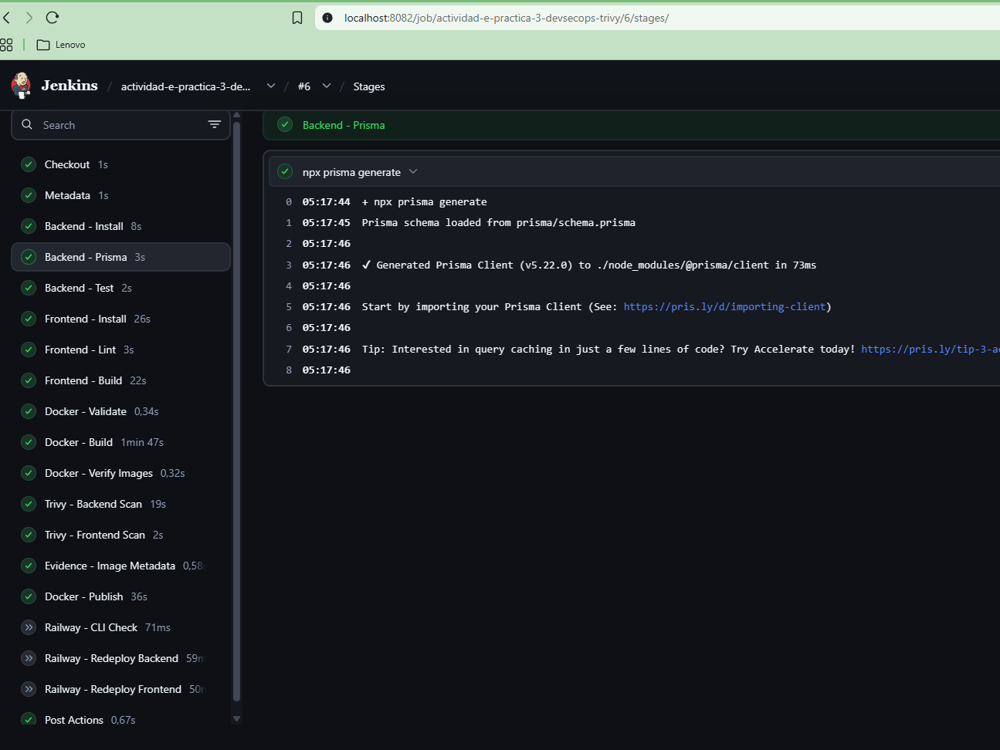

Se ajusto el `Jenkinsfile` para utilizar la credencial existente en Jenkins:

```text
dockerhub-cazzsoft
```

Tambien se configuro la variable:

```text
SKIP_RAILWAY_DEPLOY = 'true'
```

Con esto se evito modificar servicios Railway de practicas anteriores.

El build `#6` finalizo en estado `SUCCESS`, completando:

- Construccion de imagenes Docker.
- Analisis Trivy para backend y frontend.
- Generacion de artefactos.
- Publicacion en Docker Hub.
- Omision controlada de Railway.

## 5. Docker Hub

### 5.1 Imagen backend publicada

**Evidencia:** `evidencias/dockerhub/01_backend_tags_publicados.png`

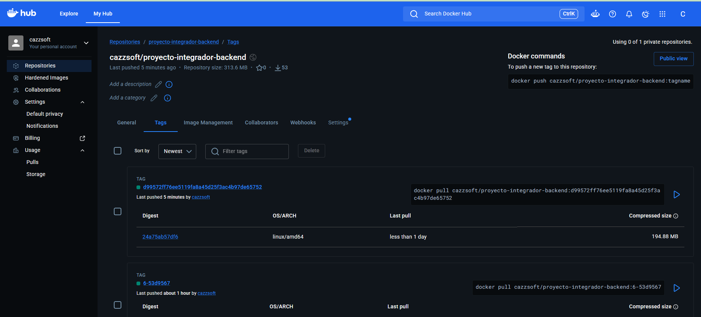

Se verifico en Docker Hub la publicacion de la imagen:

```text
cazzsoft/proyecto-integrador-backend
```

La imagen cuenta con tags generados por el pipeline, incluyendo el tag asociado al commit de GitHub Actions.

### 5.2 Imagen frontend publicada

**Evidencia:** `evidencias/dockerhub/02_frontend_tags_publicados.png`

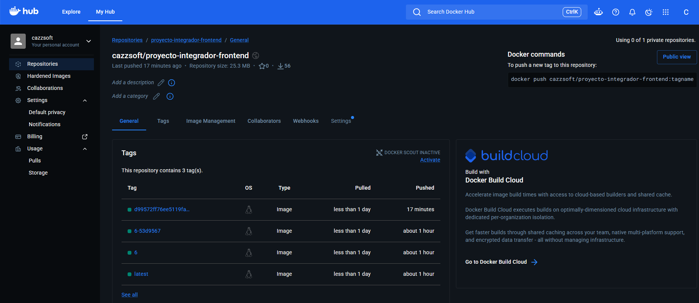

Se verifico en Docker Hub la publicacion de la imagen:

```text
cazzsoft/proyecto-integrador-frontend
```

La imagen cuenta con tags publicados por Jenkins y GitHub Actions.

## 6. GitHub Actions

### 6.1 Secrets y variables

Se configuraron los valores requeridos para que GitHub Actions pueda autenticarse en Docker Hub.

**Secret:**

```text
DOCKERHUB_TOKEN
```

**Variable:**

```text
DOCKERHUB_USERNAME = cazzsoft
```

**Evidencias:**

- `evidencias/github/03_secret_dockerhub_token.png`

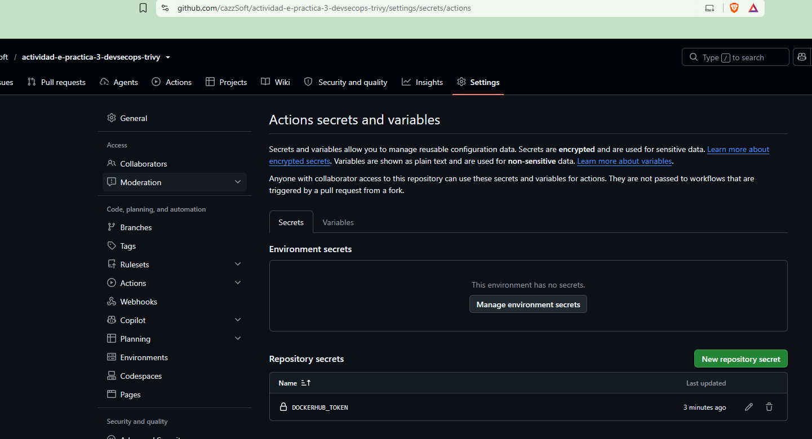
- `evidencias/github/04_variable_dockerhub_username.png`

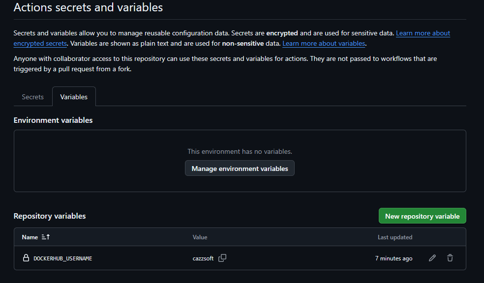

### 6.2 Runner self-hosted

Se instalo un runner self-hosted en la instancia EC2 y se registro en GitHub con el nombre:

```text
aws-k3s
```

Labels registrados:

```text
self-hosted, Linux, X64, aws-k3s
```

**Evidencias:**

- `evidencias/aws/06_runner_servicio_activo.png`

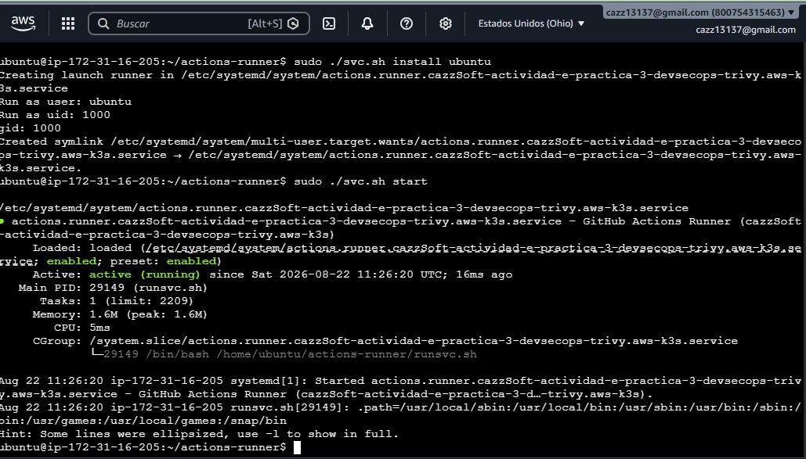
- `evidencias/github/05_runner_idle.png`

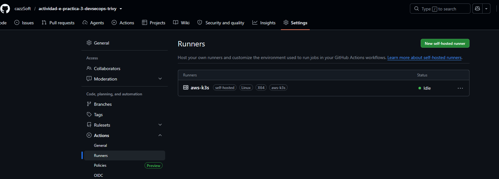

### 6.3 Ejecucion del workflow Kubernetes

**Evidencias:**

- `evidencias/github/06_workflow_kubernetes_en_progreso.png`

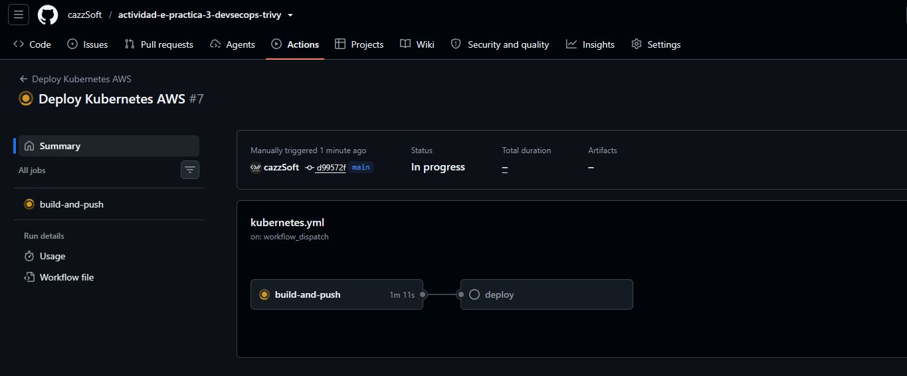
- `evidencias/github/07_workflow_kubernetes_success.png`

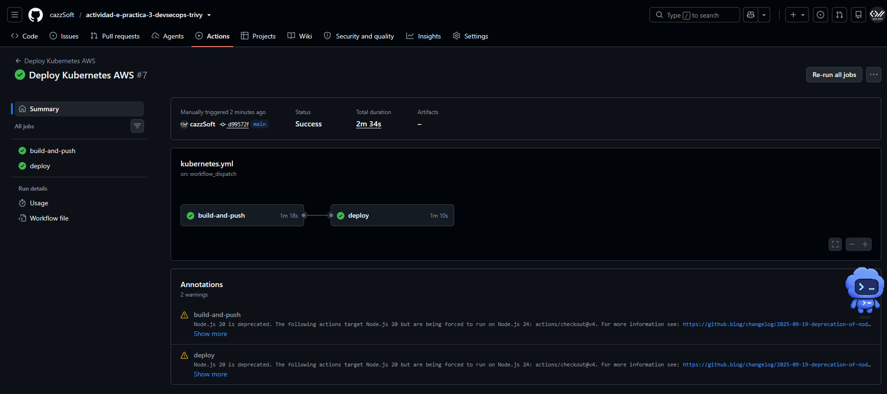

Se ejecuto manualmente el workflow `Deploy Kubernetes AWS`, usando `workflow_dispatch` sobre la rama `main`.

El workflow completo finalizo en estado `Success`, completando los jobs:

- `build-and-push`
- `deploy`

## 7. AWS EC2 y K3s

### 7.1 Instancia EC2

Se creo una instancia EC2 en AWS para alojar el cluster K3s.

Configuracion utilizada:

- Ubuntu Server.
- Tipo de instancia `t3.small`.
- Almacenamiento `25 GiB gp3`.
- Puerto `80` habilitado para HTTP.
- Puerto `22` utilizado para administracion por consola/SSH.

**Evidencias:**

- `evidencias/aws/01_ec2_instancia_en_ejecucion.png`

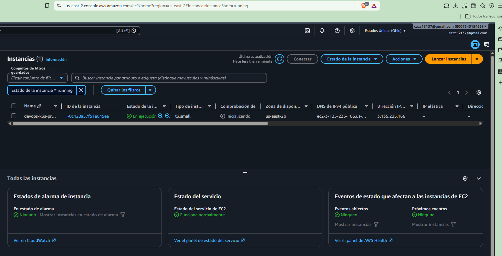
- `evidencias/aws/02_ec2_comprobaciones_ok.png`

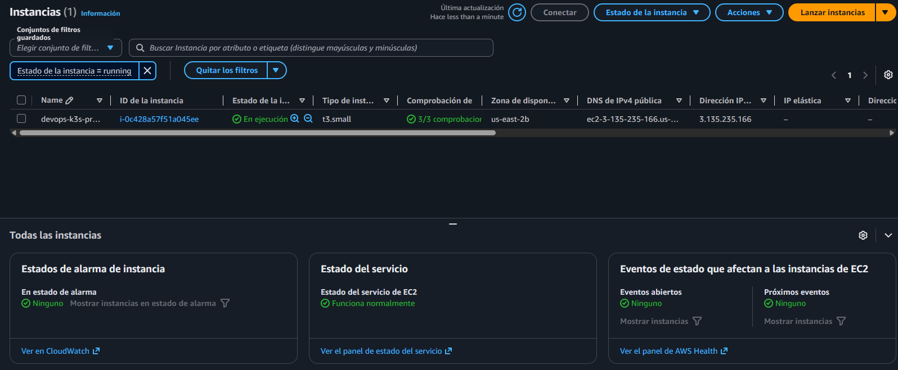

### 7.2 Instalacion de K3s

**Evidencia:** `evidencias/aws/03_k3s_service_running.png`

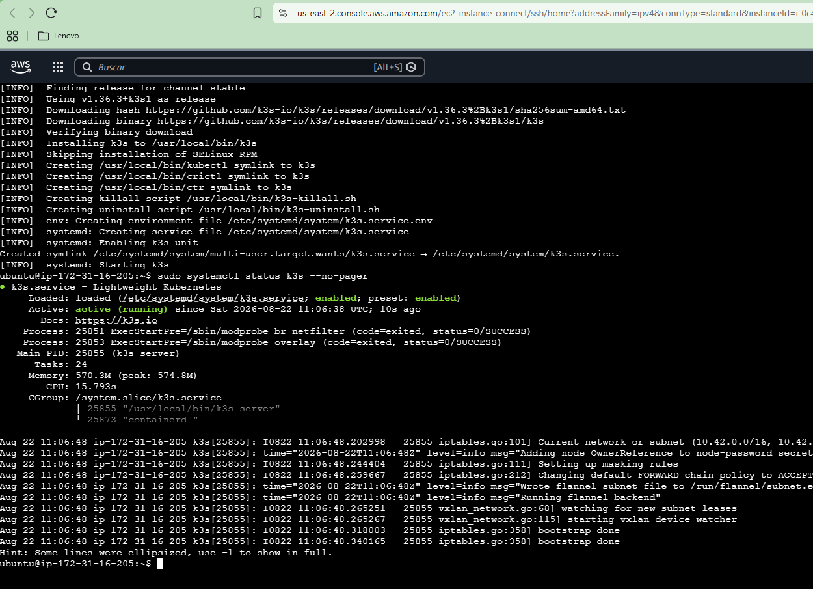

Se instalo K3s en la instancia EC2. El servicio fue validado mediante:

```bash
sudo systemctl status k3s --no-pager
```

Resultado observado:

```text
active (running)
```

### 7.3 Validacion del cluster Kubernetes

**Evidencia:** `evidencias/aws/04_k3s_node_pods_ready.png`

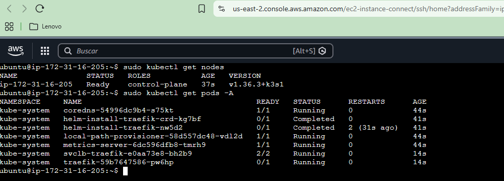

Se valido el nodo y los pods base con:

```bash
sudo kubectl get nodes
sudo kubectl get pods -A
```

El nodo aparece en estado `Ready` con rol `control-plane`.

### 7.4 Kubeconfig para usuario ubuntu

**Evidencia:** `evidencias/aws/05_kubectl_usuario_ubuntu_ready.png`

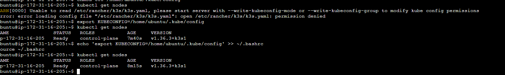

Se configuro el archivo:

```text
/home/ubuntu/.kube/config
```

Tambien se exporto la variable:

```bash
KUBECONFIG=/home/ubuntu/.kube/config
```

Con esto, el usuario `ubuntu` puede ejecutar `kubectl` sin `sudo`, requisito necesario para que el runner self-hosted despliegue sobre K3s.

## 8. Despliegue Kubernetes

### 8.1 Recursos desplegados

**Evidencia:** `evidencias/aws/08_k8s_pods_services_ingress_curl.png`

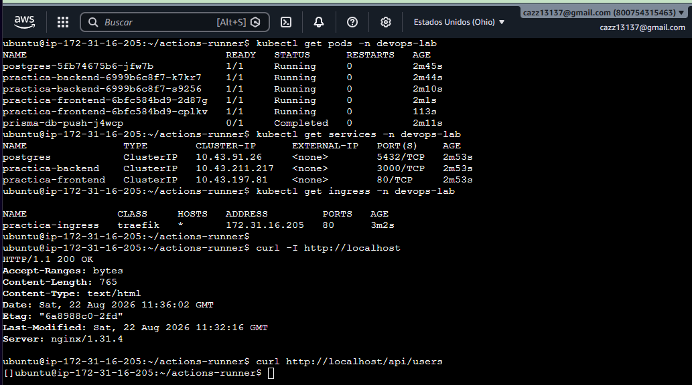

Se verificaron los recursos desplegados en el namespace `devops-lab`:

```bash
kubectl get pods -n devops-lab
kubectl get services -n devops-lab
kubectl get ingress -n devops-lab
```

Resultados observados:

- Pods de PostgreSQL, backend y frontend en estado `Running`.
- Job `prisma-db-push` en estado `Completed`.
- Servicios `postgres`, `practica-backend` y `practica-frontend` creados.
- Ingress `practica-ingress` publicado por Traefik en puerto `80`.

### 8.2 Validacion HTTP y API

**Evidencias:**

- `evidencias/aws/07_aplicacion_web_publica.png`

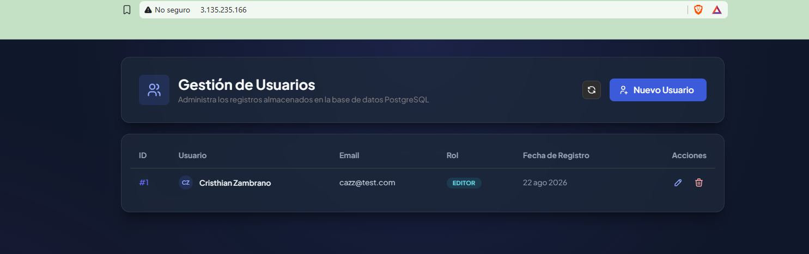
- `evidencias/aws/08_k8s_pods_services_ingress_curl.png`

Se valido el acceso local en la instancia:

```bash
curl -I http://localhost
curl http://localhost/api/users
```

Resultado:

- `HTTP/1.1 200 OK` para el frontend.
- Respuesta JSON para el endpoint `/api/users`.

Tambien se valido el acceso publico desde navegador mediante la IP publica de la instancia EC2:

```text
http://3.135.235.166
```

La interfaz `Gestion de Usuarios` cargo correctamente.

## 9. Resultado final

La practica fue completada correctamente. El informe evidencia tanto el analisis de seguridad con Trivy como el despliegue de la aplicacion en AWS K3s:

- Jenkins ejecuto build, pruebas, Docker, Trivy y publicacion en Docker Hub.
- Trivy genero reportes de vulnerabilidades para backend y frontend.
- Docker Hub recibio las imagenes del proyecto.
- GitHub Actions construyo y publico imagenes usando secrets/variables del repositorio.
- Un runner self-hosted en AWS ejecuto el despliegue sobre K3s.
- Kubernetes desplego PostgreSQL, backend, frontend e ingress.
- La aplicacion quedo accesible publicamente por HTTP.

## 10. Conclusiones

La practica permitio comprobar un flujo completo de DevSecOps y CI/CD, iniciando con el analisis de vulnerabilidades mediante Trivy y finalizando con el despliegue automatizado de la aplicacion en AWS K3s. La separacion entre Jenkins, Docker Hub, GitHub Actions y K3s permitio validar distintas etapas del ciclo de vida DevOps.

Se identificaron y corrigieron incidencias de entorno, como la ausencia de Docker Compose en Jenkins y la diferencia entre credenciales configuradas y credenciales esperadas por el pipeline. Finalmente, el despliegue en AWS K3s fue exitoso y la aplicacion quedo disponible desde internet.


